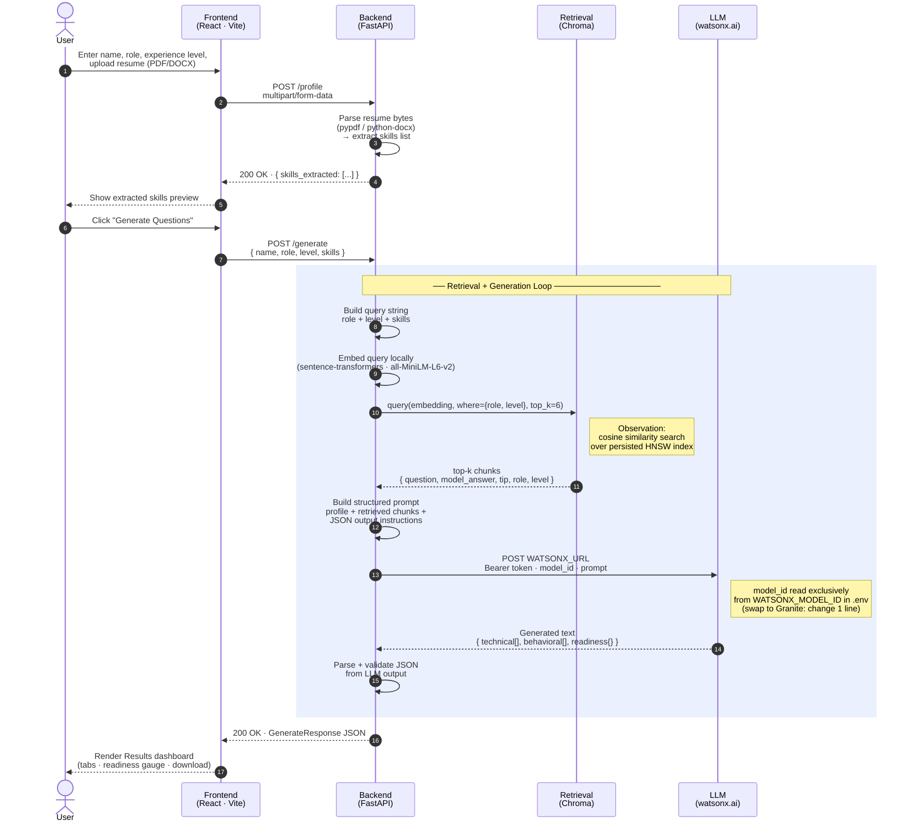

# Architecture Blueprint — Interview Trainer Agent

## 1. System Sequence Diagram

The diagram below is a UML-style sequence diagram showing the full request/response flow, with a **Retrieval + Generation loop** in the middle that mirrors a ReAct-style agent cycle (observe → think → act).



---

## 2. Component Descriptions

### 2.1 React Frontend (Vite)
Located in `frontend/`. A single-page application with three views:

| Page | Purpose |
|---|---|
| **Profile Setup** | Name, experience level, job role, drag-and-drop resume upload, inline validation |
| **Results & Tips** | Technical / behavioral question tabs, expandable model answers, tips, readiness gauge chart, download prep sheet |
| **History** | Shows the last 10 sessions (in-memory for the current browser tab) |

The frontend calls the backend via a Vite dev proxy (`/api → http://localhost:8000`), so no CORS issues during development. In production, point any reverse-proxy at the same backend.

---

### 2.2 FastAPI Backend
Located in `backend/`. Three endpoints:

| Method | Path | Purpose |
|---|---|---|
| `GET` | `/health` | Liveness check; reports vector store status and whether watsonx.ai is configured |
| `POST` | `/profile` | Accepts form fields + optional resume file; returns extracted skills |
| `POST` | `/generate` | Runs the full RAG pipeline; returns structured question set |

**Clean separation of concerns:**

```
backend/
├── main.py                  # FastAPI app + CORS middleware
├── config.py                # Settings (pydantic-settings, reads .env)
├── api/
│   ├── routes.py            # Route handlers
│   └── models.py            # Pydantic request/response schemas
├── ingestion/
│   ├── build_vector_store.py  # One-time build script (local only)
│   └── corpus/              # JSON knowledge base (add more files to extend)
├── retrieval/
│   └── vector_store.py      # Chroma query + lazy-loaded embedding model
├── generation/
│   └── generator.py         # Prompt construction + watsonx.ai REST call
└── resume_parser/
    └── parser.py            # PDF/DOCX text extraction + skill keyword scan
```

---

### 2.3 Local Knowledge Base (Corpus)
Located in `backend/ingestion/corpus/`. Five seed JSON files, one per role:

| File | Role | Questions |
|---|---|---|
| `software_engineer.json` | Software Engineer | 15 (technical + behavioral, all three levels) |
| `data_analyst.json` | Data Analyst | 14 |
| `product_manager.json` | Product Manager | 13 |
| `hr_specialist.json` | HR Specialist | 13 |
| `sales_executive.json` | Sales Executive | 14 |

**Extending the corpus:** Drop a new JSON file with the same schema into `corpus/` and re-run `python -m ingestion.build_vector_store`. No code changes required.

---

### 2.4 Embedding Step (sentence-transformers)
Model: **`all-MiniLM-L6-v2`** — runs entirely locally after the first download (~85 MB). No API key, no watsonx.ai call. The model is cached in the OS Hugging Face cache (`~/.cache/huggingface`).

The [`build_vector_store.py`](backend/ingestion/build_vector_store.py) script:
1. Loads the embedding model
2. Flattens all corpus JSON into text chunks
3. Embeds each chunk
4. Stores embeddings + metadata in Chroma (incremental — won't re-embed existing IDs)

---

### 2.5 Chroma Vector Store
Persisted at `backend/vector_store/chroma_db/` (local directory, no external service). Uses cosine similarity. On each `/generate` request, the query is embedded locally and the top-k most relevant chunks are retrieved, filtered by role and experience level where possible.

---

### 2.6 Generation (watsonx.ai — raw REST API)
[`generator.py`](backend/generation/generator.py) builds a structured prompt that includes:
- Candidate profile (name, role, level, skills)
- Retrieved corpus chunks (context)
- Strict JSON output instructions

It then:
1. Exchanges the API key for an IAM bearer token (`iam.cloud.ibm.com`)
2. POSTs to `WATSONX_URL` exactly as provided in `.env` — no URL manipulation
3. Parses the generated JSON from the LLM response

**Model-swappable design:** The `model_id` sent in the request body is read exclusively from `settings.WATSONX_MODEL_ID`. To switch to any Granite model, change only the `WATSONX_MODEL_ID` value in `.env`. Zero code changes.

---

### 2.7 Resume Parser
[`parser.py`](backend/resume_parser/parser.py) accepts PDF or DOCX bytes, extracts plain text, and scans for ~50 common skill keywords (languages, frameworks, cloud tools, methodologies). The extracted skill list enriches the Chroma retrieval query.

---

## 3. Full Project Folder Structure

```
interview-trainer-agent/
│
├── .env.example                  ← Template (commit this; never commit .env)
│
├── backend/
│   ├── .env                      ← Your real credentials (git-ignored)
│   ├── config.py                 ← Central settings via pydantic-settings
│   ├── main.py                   ← FastAPI entry point
│   ├── requirements.txt
│   │
│   ├── api/
│   │   ├── __init__.py
│   │   ├── routes.py
│   │   └── models.py
│   │
│   ├── ingestion/
│   │   ├── __init__.py
│   │   ├── build_vector_store.py ← Run once to embed corpus
│   │   └── corpus/
│   │       ├── software_engineer.json
│   │       ├── data_analyst.json
│   │       ├── product_manager.json
│   │       ├── hr_specialist.json
│   │       └── sales_executive.json
│   │
│   ├── retrieval/
│   │   ├── __init__.py
│   │   └── vector_store.py
│   │
│   ├── generation/
│   │   ├── __init__.py
│   │   └── generator.py
│   │
│   ├── resume_parser/
│   │   ├── __init__.py
│   │   └── parser.py
│   │
│   └── vector_store/             ← Created at build time (git-ignored)
│       └── chroma_db/
│
└── frontend/
    ├── index.html
    ├── package.json
    ├── vite.config.ts
    ├── tsconfig.json
    └── src/
        ├── main.tsx
        ├── App.tsx
        ├── index.css
        ├── types.ts
        ├── api.ts
        ├── components/
        │   ├── Layout.tsx
        │   └── Layout.module.css
        └── pages/
            ├── ProfilePage.tsx
            ├── ProfilePage.module.css
            ├── ResultsPage.tsx
            ├── ResultsPage.module.css
            ├── HistoryPage.tsx
            └── HistoryPage.module.css
```

---

## 4. IBM Lite Constraint Notes

| Component | Service | Lite-tier compliant? |
|---|---|---|
| LLM inference | **IBM watsonx.ai** (REST API) | ✅ Yes — IBM Cloud Lite |
| Embeddings | sentence-transformers (local) | ✅ Yes — fully offline, no IBM service needed |
| Vector store | Chroma (local, embedded) | ✅ Yes — no hosted service |
| Resume parsing | pypdf / python-docx (local) | ✅ Yes — local libraries |

**Granite model swap:** The generation model is currently `meta-llama/llama-3-3-70b-instruct` because IBM Granite is not yet available in this watsonx.ai project's catalog. When it becomes available, change **only** `WATSONX_MODEL_ID` in `backend/.env` to the Granite model ID (e.g. `ibm/granite-13b-instruct-v2`). No other change is needed in any file.
